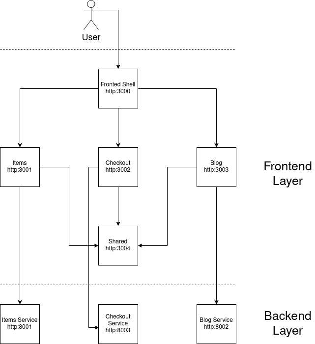

# Clothes Shop Micro-Services

This is a simple proof of concept project that showcases how a large scale application could be built using the micro-services architecture. Traditionally, only the backend
side of the application would have been split into multiple micro-services. However,
by making uses of the [Webpack 5 module federation feature](), this project also splits the classic frontend monolith into multiple micro frontend services.

This application is structured as a monorepo, for a easier development and deployment
flow. The main technologies used here are React, NodeJS and Docker.

Each separate service has it's own file inside `products` and it's own Dockerfile. Each 
service can be manipulated easily using the `docker-compose.yml` file.

# Commands

At first, you will need to install all the needed dependencies, using the following command

> yarn install 

In order to start the project, you can run the following commands:

> yarn start // starts the dev servers
> 
> yarn start:live // starts the dev servers with hot reloading on
> 
> yarn build:serve:all // buils all MFEs for production and serves them all with serve

In order to build and run the Docker containers, run the following commands:

> sudo docker-compose up --build // build all docker containers and start them
> 
> sudo docker-compose up // start all the docker containers

# Architecture

